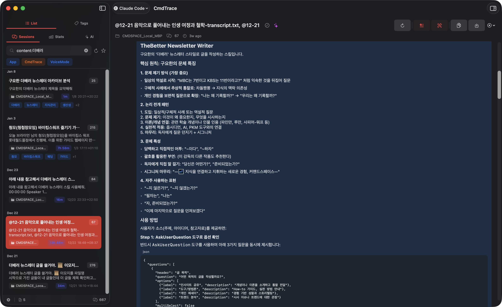
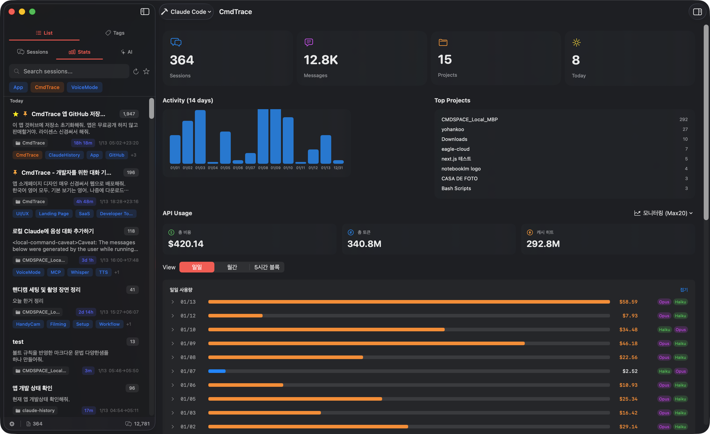
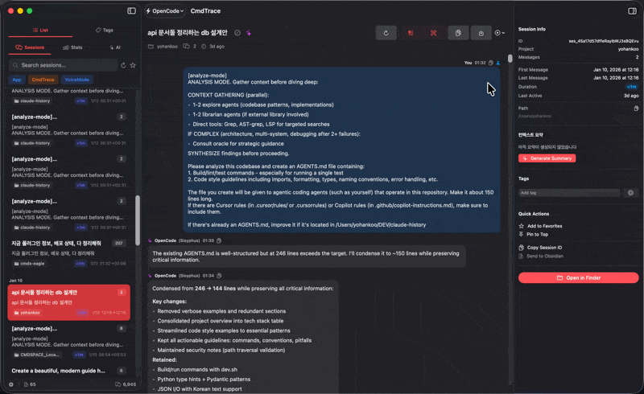
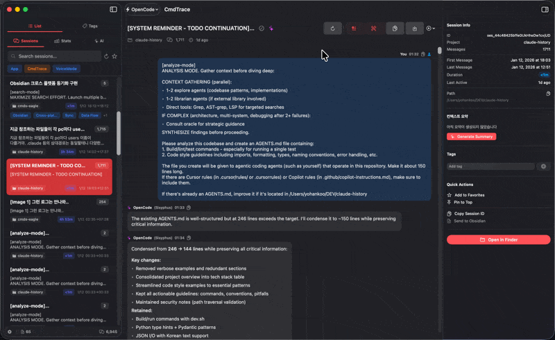

# CmdTrace

<p align="center">
  
</p>

<p align="center">
  <strong>Stop losing your AI conversations.<br>Start finding them.</strong>
</p>

<p align="center">
  macOS native session viewer for AI CLI coding assistants
</p>

<p align="center">
  <a href="#features">Features</a> •
  <a href="#screenshots">Screenshots</a> •
  <a href="#installation">Installation</a> •
  <a href="#search-queries">Search Queries</a> •
  <a href="#settings">Settings</a> •
  <a href="#keyboard-shortcuts">Shortcuts</a>
</p>

---

## The Problem

*"I know Claude solved this before..."*

You've had 47 sessions this week. The solution you need is buried somewhere in conversation #23... or was it #31? Session names like `01JHHK9X2MPQR5...` tell you nothing.

```
~/.claude/projects/*/sessions/*.jsonl
127 files, 2.3GB of conversations
```

Every day, developers lose **15-30 minutes** searching for past AI conversations. That's **2+ hours per week** of productivity lost.

## The Solution

**CmdTrace brings order to chaos.** A native macOS app that understands how you work with AI coding assistants.

---

## Features

### 🔍 Find Anything, Instantly

Powerful search operators let you pinpoint exactly what you need. Combine them for laser-precise results.

```
content:authentication          # Search inside conversations
tag:backend project:api         # Filter by tag and project
title:refactor date:today       # Find today's refactoring sessions
```

### 🔄 Multi-CLI Support

Switch between Claude Code, OpenCode, and Antigravity instantly. Sessions are pre-cached for zero wait time.

| CLI Tool | Session Path |
|----------|--------------|
| **Claude Code** | `~/.claude/projects/*/sessions/` |
| **OpenCode** | `~/.opencode/sessions/` |
| **Antigravity** | `~/.antigravity/sessions/` |

### 🏷️ Your Organization

- **Custom Names**: Give sessions meaningful titles
- **Tags**: Nested tags with colors and importance levels
- **Favorites & Pins**: Quick access to important sessions
- **Deep Links**: `cmdtrace://session/{id}` for quick access

### ⚡ Instant Resume

Jump back into any session with one click. Supports Terminal, iTerm2, and Warp.

### 📊 Usage Monitoring

Real-time monitoring with burn rate predictions. Never hit your plan limit unexpectedly again.

- Token usage by model (Opus, Sonnet, Haiku)
- Cost tracking with burn rate projection
- Plan limits for Pro, Max5, Max20
- Integrates with ccusage & claude-monitor

### 🤖 AI-Powered Summaries

Let AI analyze your sessions and generate meaningful titles and summaries. Never struggle with cryptic session names again.

- Auto-generate session titles from content
- Smart summaries with key points
- Tag suggestions based on content
- Configurable context window and prompts


### 📤 Export Sessions (v2.3.0+)

Export your sessions in multiple formats:

- **Markdown**: Full conversation with headers and formatting
- **JSON**: Raw data for programmatic access
- **Plain Text**: Simple text output
- **HTML**: Styled HTML document

### 🔀 Session Diff (v2.3.0+)

Compare two sessions side-by-side:

- Side-by-side view
- Unified diff view
- Statistics comparison (message count, duration, timestamps)

### 📈 Statistics Dashboard (v2.3.0+)

Comprehensive analytics for your sessions:

- 30-day activity chart
- Project distribution
- Tag usage breakdown
- Total messages and session counts
---

## Screenshots

### Main Interface

*Session list with conversation preview, tags, and organization tools*

### Powerful Search

*Search with operators: content:, title:, tag:, project:, date:*

### Multi-CLI Support

*Instantly switch between Claude Code, OpenCode, and Antigravity*

### Usage Dashboard

*Real-time usage monitoring with burn rate predictions*

### Instant Resume

*One-click resume to Terminal, iTerm2, or Warp*

### AI Summary Generation

*AI-generated titles, summaries, and tag suggestions*

---

## Installation

### Download DMG

Download the latest release from the [Releases](https://github.com/johnfkoo951/CmdTrace/releases) page.

### Build from Source

```bash
# Clone the repository
git clone https://github.com/johnfkoo951/CmdTrace.git
cd CmdTrace

# Build release app bundle
./build-app.sh

# Install to Applications
cp -r ./build/CmdTrace.app /Applications/
```

### Build DMG

```bash
# Build app first
./build-app.sh

# Create distributable DMG
./build-dmg.sh
```

### Run in Development

```bash
swift build
swift run
```

---

## Troubleshooting

### ⚠️ "App is damaged" Warning

This is macOS Gatekeeper blocking unsigned apps downloaded from the internet. Run this command in Terminal:

```bash
xattr -cr /Applications/CmdTrace.app
```

Or right-click the app and select "Open" (first time only).

### 🔐 Resume Session Not Working

CmdTrace needs permissions to control terminal apps via AppleScript.

**System Settings → Privacy & Security → Automation:**
- Enable: CmdTrace → Terminal ✓
- Enable: CmdTrace → iTerm ✓

**For Warp users (additional):**

**System Settings → Privacy & Security → Accessibility:**
- Add CmdTrace to the list ✓

These permissions allow CmdTrace to open terminal windows and paste resume commands.

---

## Search Queries

CmdTrace supports powerful search operators to find sessions quickly.

### Basic Search

| Query | Description |
|-------|-------------|
| `authentication` | Full-text search in titles and content |
| `"error handling"` | Exact phrase search |

### Search Operators

| Operator | Example | Description |
|----------|---------|-------------|
| `content:` | `content:useState` | Search inside conversation messages |
| `title:` | `title:refactor` | Search session titles only |
| `tag:` | `tag:backend` | Filter by tag |
| `project:` | `project:api-server` | Filter by project name |
| `date:` | `date:today` | Filter by date |

### Date Filters

| Filter | Description |
|--------|-------------|
| `date:today` | Sessions from today |
| `date:yesterday` | Sessions from yesterday |
| `date:week` | Sessions from this week |
| `date:month` | Sessions from this month |
| `date:2024-01-15` | Sessions from specific date |
| `date:2024-01-01..2024-01-31` | Sessions in date range |

### Advanced Filters (v2.3.0+)

| Operator | Example | Description |
|----------|---------|-------------|
| `regex:` | `regex:\.swift$` | Regular expression search |
| `messages:` | `messages:>10` | Filter by message count |

**Message count operators:**
- `messages:>10` - More than 10 messages
- `messages:<5` - Less than 5 messages
- `messages:=20` - Exactly 20 messages
- `messages:10..50` - Between 10 and 50 messages

### Combined Queries
### Combined Queries

```bash
# Find backend API work from today
tag:backend project:api date:today

# Search for authentication-related refactoring
content:authentication title:refactor

# Find React hook implementations tagged as important
content:useState tag:important
```

---

## Settings

### General Settings

| Setting | Description | Default |
|---------|-------------|---------|
| **CLI Tool** | Active CLI tool (Claude Code, OpenCode, Antigravity) | Claude Code |
| **Theme** | Light/Dark/System | System |
| **Default Tab** | Starting tab on launch | Sessions |
| **Auto-refresh** | Refresh sessions on app focus | Enabled |

### Terminal Settings

| Setting | Description | Default |
|---------|-------------|---------|
| **Terminal App** | Terminal for session resume | Terminal.app |
| **Options** | iTerm2, Warp, Terminal | - |

### AI Provider Settings

Configure API keys for AI-powered features (title/summary generation):

| Provider | Key Setting | Models |
|----------|-------------|--------|
| **Anthropic** | Anthropic API Key | Claude 3 Haiku (default) |
| **OpenAI** | OpenAI API Key | GPT-4o, GPT-4o-mini |
| **Google** | Gemini API Key | Gemini Pro |
| **xAI** | Grok API Key | Grok |

### Context Summary Settings

Configure how AI generates summaries:

| Setting | Description | Default |
|---------|-------------|---------|
| **Max Messages** | Number of recent messages to analyze | 50 |
| **Max Chars/Message** | Character limit per message | 500 |
| **Context Prompt** | Custom prompt for AI summary generation | (Built-in template) |

### Usage Monitoring Settings

| Setting | Description | Default |
|---------|-------------|---------|
| **Plan Type** | Claude plan (Pro, Max5, Max20) | Pro |
| **Auto-refresh Interval** | Monitoring refresh rate | 30s |
| **ccusage Path** | Path to ccusage binary | Auto-detect |

### Color Customization

Customize the native monitoring view colors:

| Element | Description |
|---------|-------------|
| **Cost Bar** | Cost usage progress bar |
| **Token Bar** | Token usage progress bar |
| **Message Bar** | Message count progress bar |
| **Warning** | Warning/limit exceeded indicator |

---

## Usage Tools Integration

CmdTrace integrates with popular usage monitoring tools.

### ccusage (Required for Native Monitoring)

```bash
# Install globally
npm install -g ccusage

# Or use npx
npx ccusage@latest
```

**Commands used by CmdTrace:**

```bash
# Native monitoring data (5-hour block)
ccusage blocks --active --json --breakdown

# Daily view
ccusage daily --json --since YYYYMMDD

# Monthly view
ccusage monthly --json
```

### claude-monitor (Optional TUI)

```bash
# Install with pip
pip install claude-monitor

# Or with uv
uv tool install claude-monitor
```

### Native Monitoring View

Built-in real-time monitoring without Terminal:

1. Go to **Dashboard** tab
2. Find **Usage Tools** section
3. Click menu button (•••)
4. Select **Native Monitoring**

**Features:**
- Toggle between Token and Cost views
- Click palette icon to customize colors
- Set auto-refresh interval (5s, 10s, 30s, 60s)
- View burn rate predictions with Swift Charts

---

## Keyboard Shortcuts

| Shortcut | Action |
|----------|--------|
| `⌘R` | Refresh sessions |
| `⌘F` | Focus search |
| `⌘1` | Sessions tab |
| `⌘2` | Dashboard tab |
| `⌘3` | AI Interaction tab |
| `⌘,` | Open Settings |
| `↑↓` | Navigate session list |

---

## Data Paths

### Session Logs (Read-only)

| CLI Tool | Path |
|----------|------|
| Claude Code | `~/.claude/projects/*/sessions/*.jsonl` |
| OpenCode | `~/.opencode/sessions/*.jsonl` |
| Antigravity | `~/.antigravity/sessions/*.jsonl` |

### App Data

| File | Description |
|------|-------------|
| `~/Library/Application Support/CmdTrace/settings.json` | App settings |
| `~/Library/Application Support/CmdTrace/session-metadata.json` | Custom names, favorites |
| `~/Library/Application Support/CmdTrace/tag-database.json` | Tag definitions |
| `~/Library/Application Support/CmdTrace/summaries.json` | AI-generated summaries |

---

## Project Structure

```
Sources/
├── App/
│   ├── CmdTraceApp.swift       # App entry point, window/menu config
│   └── AppState.swift          # Global state (@Observable), settings
├── Models/
│   ├── Session.swift           # Session data model
│   └── Message.swift           # Message/conversation models
├── Services/
│   └── SessionService.swift    # JSONL file parsing, session loading
└── Views/
    ├── ContentView.swift       # Main layout (NavigationSplitView)
    ├── SidebarView.swift       # Session list, tags, search/filter
    ├── DetailView.swift        # Conversation view, dashboard, AI
    └── SettingsView.swift      # App settings UI

website/
├── index.html                  # Product landing page
├── styles.css                  # Website styles
├── script.js                   # Interactive features
└── screenshots/                # App screenshots and GIFs
```

---

## Tech Stack

- **Language**: Swift 5.9+
- **UI Framework**: SwiftUI (macOS 14+)
- **Charts**: Swift Charts
- **State Management**: Swift Observation (`@Observable`)
- **Package Manager**: Swift Package Manager
- **Data Storage**: JSON files

---

## Requirements

- **macOS**: 14.0 (Sonoma) or later
- **Swift**: 5.9+
- **Optional**: ccusage (for native monitoring)
- **Optional**: claude-monitor (for TUI monitoring)

---

## License

Copyright (c) 2025 CMDSPACE. All Rights Reserved.

This is proprietary software. See [LICENSE](LICENSE) for details.

---

## Contact

For licensing inquiries: johnfkoo951@gmail.com

---

<p align="center">
  Made with ❤️ in SwiftUI
</p>
